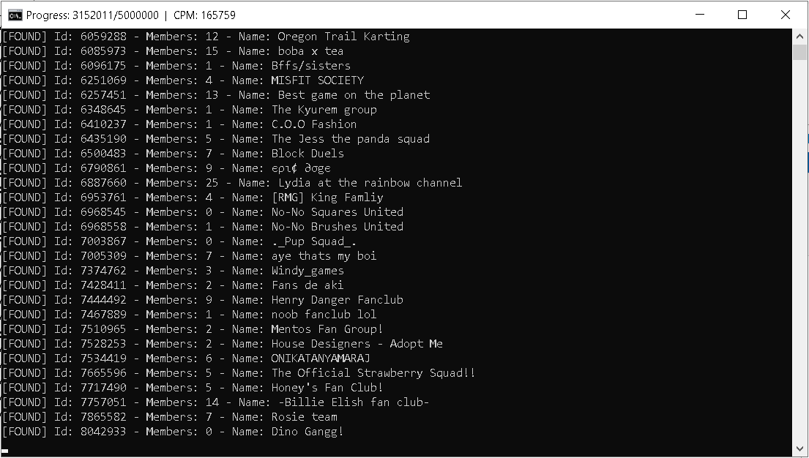

# roblox-group-scraper
Tool for finding ownerless Roblox groups.

(server: hetzner ex62-nvme (de), proxies: awmproxy vip, threads: 500)

# Config
- `threadCount`: amount of threads to be used for scanning
- `displayErrors`: show errors related to scanning
- `isLooped`: scanning will restart from min once it reaches max range
- `webhookUrl`: found groups will be sent to the specified webhook url via an embed
- `minMemberCount`: groups with member counts below this amount won't be shown
- `range`: group ids will count from `min`, up until `max`

# Output
Matched groups will be logged into the file `found.csv` with the following fields:
- Id
- Member count
- Url
- Name

# Usage
- Download and install the latest Python 3 release from https://www.python.org/downloads/ (while installing, check 'Add to PATH')
- Download and extract the tool from https://github.com/h0nde/roblox-group-scraper/archive/main.zip
- Set up config.json to your preferences
- Add your HTTP/S proxies to proxies.txt
- Launch scraper.bat
